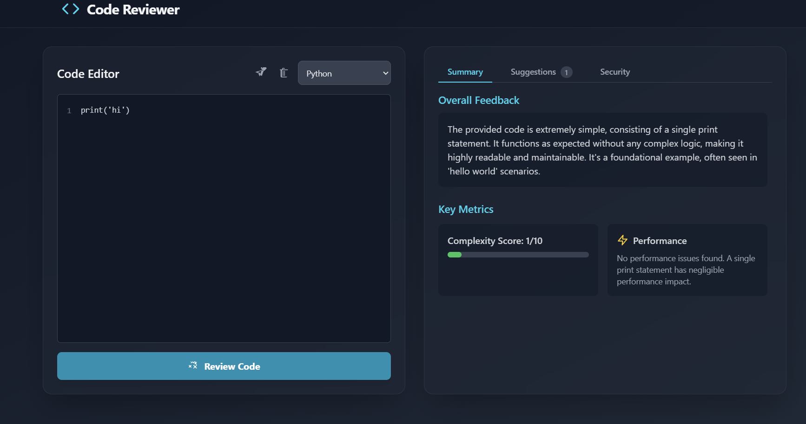

# Code Reviewer

An intelligent, AI-powered tool that leverages the Google Gemini API to perform automated code reviews. It provides insightful feedback, identifies potential issues, and offers suggestions to improve code quality, performance, and security.



## ✨ Features

- **🤖 AI-Powered Analysis**: Utilizes Google's Gemini model to provide human-like code reviews.
- **🌐 Multi-Language Support**: Review code in various languages including JavaScript, Python, TypeScript, Java, and more.
- **📝 Interactive Code Editor**: A feature-rich editor with line numbers and syntax awareness.
- **💡 Actionable Suggestions**: Get specific, line-by-line suggestions categorized by severity (Critical, Major, Minor, Info).
- **🚀 Performance & Security Audits**: Identifies potential performance bottlenecks and common security vulnerabilities.
- **🧮 Complexity Scoring**: A quantitative measure of your code's intricacy to help manage complexity.
- **💅 Sleek & Modern UI**: A responsive, dark-mode interface built with Tailwind CSS for a great user experience.
- **⏳ Smart Cooldown**: Includes a client-side cooldown mechanism to help manage API rate limits gracefully.
- **🖱️ Interactive Feedback**: Click on a suggestion to instantly highlight the corresponding line of code in the editor.

## 🛠️ Tech Stack

- **Frontend**: React, TypeScript
- **Styling**: Tailwind CSS
- **AI**: Google Gemini API (`@google/genai`)
- **Dependencies**: Served via `esm.sh` (no local `node_modules` required for these dependencies)

## 🚀 Getting Started

### Prerequisites

You need a Google Gemini API key to use this application.(I'm broke so i use gemini free keys)

1.  Go to [Google AI Studio](https://aistudio.google.com/app/keys).
2.  Click **"Create API key"** and copy your new key.

### Installation

This project is designed for simplicity and can be run by serving the files directly from a static web server. No complex build process is required.

1.  **Clone the repository:**
    ```bash
    git clone https://github.com/RajdeepKushwaha5/code-reviewer.git
    cd code-reviewer
    ```
2.  **Set up your API Key:**
    The application is designed to securely use an API key from an environment variable. When deploying or running this application, you must ensure that `process.env.API_KEY` is available to the runtime environment. For local development with simple servers, you may need to replace `process.env.API_KEY` in `services/geminiService.ts` temporarily, but **do not commit this change**.

    *Correct, secure approach for production/deployment:*
    ```typescript
    // In services/geminiService.ts (keep this for production)
    const ai = new GoogleGenAI({ apiKey: process.env.API_KEY });
    ```
    You would then set the `API_KEY` in your deployment environment (e.g., Vercel, Netlify, or a custom server environment).

3.  **Run with a local server:**
    You can use any simple static server. If you have Node.js installed, you can use a package like `serve`.

    ```bash
    # Install serve globally if you don't have it
    npm install -g serve

    # Run the server from the project root
    serve .
    ```
    The application will be available at the URL provided by the server (e.g., `http://localhost:3000`).

## usage How to Use

1.  **Paste Your Code**: Write or paste code into the editor on the left.
2.  **Select Language**: Choose the correct programming language from the dropdown menu.
3.  **Start Review**: Click the **"Review Code"** button.
4.  **View Results**:
    -   The results will appear in the panel on the right.
    -   **Summary**: Get an overall feedback summary, complexity score, and performance notes.
    -   **Suggestions**: Browse through a list of specific, actionable suggestions. Click on any suggestion to highlight the relevant code.
    -   **Security**: Review the security analysis for potential vulnerabilities.
5.  **Load a Sample**: Use the "wand" icon to load a sample code snippet and see the tool in action.

## 🤝 Contributing

Contributions are welcome! If you have ideas for new features or improvements, feel free to fork the repository, make your changes, and open a pull request.
